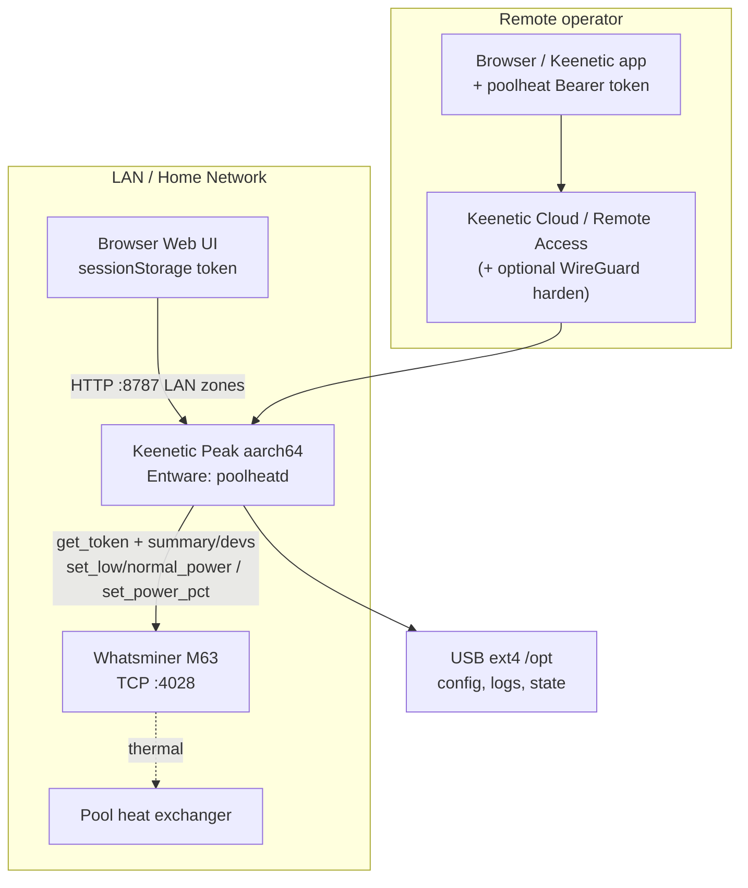
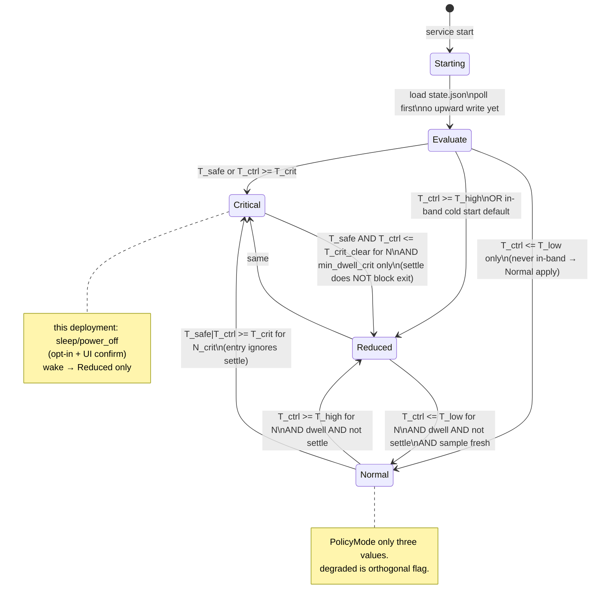

# Design Document: Keenetic Peak + Whatsminer M63 — тепловой контроллер нагрева бассейна

| Поле | Значение |
|------|----------|
| **Title** | Pool-Heating Thermal Controller for Whatsminer M63 on Keenetic Peak |
| **Author** | TBD (systems architect) |
| **Date** | 2026-07-31 |
| **Status** | Draft |
| **Version** | 0.4 (user decisions) |
| **Audience** | Senior engineers / home-lab operators |

> **User decisions 2026-07-31:** Critical→**sleep / power off** (opt-in, intended for this deployment); remote→**Keenetic Cloud / Remote Access** (not WireGuard-only); actuator strategy (**mode / pct / limit**) **pending Stage 0** — see operator explainer «Whatsminer power controls».

---

## Overview

Проект решает задачу **стабильного теплосъёма** с ASIC Whatsminer **M63**, используемого как источник тепла для **подогрева бассейна** (heat recovery / прямой теплообмен). Наблюдаемый рабочий режим: платы **0 и 1** ≈ **42.62 °C**, платы **2 и 3** ≈ **35.38 °C** — при этих температурах нагрев бассейна эффективен и предсказуем.

Предлагается лёгкий **on-router control service** на **Keenetic Peak** (Entware/OPKG, primary **linux/arm64**): периодический опрос температур плат через **Whatsminer TCP API (port 4028)**, оценка политики с **гистерезисом + min dwell + post-apply settle + consecutive samples**, применение **реалных BTMiner/Whatsminer actuators** (mapping после Stage 0; defaults `mode_only` до probe), плюс **Web UI** (LAN + token; remote — **Keenetic Cloud / Remote Access**, без raw port-forward `:8787`).

MVP **не** управляет температурой воды бассейна (нужен water sensor → Phase 2) — только **термо-безопасность и стабильность теплообменника** по board temperatures.

**Критично:** абсолютные ватты 6000/4000 как **desired heat levels** и точные write-команды **калибруются на Stage 0**; до этого — только dry-run. Critical path: **sleep/power_off** (user-chosen opt-in) после N samples + dwell — Stage 0 must verify command.

---

## Glossary (PolicyMode vs MinerPowerMode)

| Термин | Значение |
|--------|----------|
| **PolicyMode** | Состояние контроллера: `normal` \| `reduced` \| `critical` |
| **MinerPowerMode** | Дискретный power mode майнера через BTMiner API: normal / low / high (команды `set_normal_power`, `set_low_power`, `set_high_power`) |
| **power_target_w** | Командуемый целевой power (если используется limit/pct mapping); **не** путать с measured |
| **power_measured_w** | Фактическая мощность из read-back `summary` |
| **T_ctrl** | Goal A control metric: `max(selected_boards)` — default boards `{0,1}` |
| **T_safe** | Safety metric: `max(all boards)` — всегда; вход в Critical |
| **post_apply_settle** | Окно после успешного write: подавлены **только** Normal↔Reduced; **Critical entry и Critical→Reduced exit** разрешены (exit gated by `min_dwell_crit` only) |
| **degraded** | Ортогональный latch (не PolicyMode): verify/api/apply failure; блокирует upward; `policy_mode` остаётся ∈ {normal, reduced, critical} |
| **dry_run** | Policy + log/alert **без write API**; fail-safe/Critical в dry_run **не** снижают мощность на майнере |

---

## Background & Motivation

### Текущее состояние

- Майнер M63 используется как **теплогенератор** для бассейна, а не только как hashrate-машина.
- Температуры плат **несимметричны**: 0/1 горячее, 2/3 холоднее.
- Ручное переключение power mode / limit неудобно и рискованно.
- Keenetic Peak — всегда-on сеть; Entware позволяет user-space сервисы без SBC.

### Pain points

1. Thrashing при одиночном пороге.
2. Average по платам маскирует hot boards 0/1.
3. Нет журнала control actions (commanded vs measured).
4. Remote control plane без модели auth.
5. Ограничения роутера + USB SPOF для Entware.
6. Реальный Whatsminer write path: reboot на `adjust_power_limit`, ~5 min settle power %, privileged token protocol.

### Почему сейчас

Рабочая точка ≈42.6 / 35.4 °C и черновая политика 41/44 + 4000/6000. Нужна инженерная реализация: dual metrics, settle, fail-safe, startup evaluate-before-write, Stage 0 gate.

---

## Goals & Non-Goals

### Goals (MVP)

| ID | Goal |
|----|------|
| G1 | Удержание board temps в рабочем диапазоне для heat recovery (Goal A) |
| G2 | Hysteresis: `T_low < T_high < T_crit`; `T_low ≤ T_crit_clear < T_crit` (enforced) |
| G3 | PolicyMode mapping к actuators после Stage 0; desired ~6000/4000 W as goals; Critical → **sleep/power_off** (opt-in, this deployment) |
| G4 | Min dwell + **post-apply settle** (~5 min) между сменами |
| G5 | Sustained breach: N consecutive samples before action |
| G6 | Web UI: miner host, thresholds, actuator strategy, poll, metrics, status, action log, override |
| G7 | LAN token auth; remote via **Keenetic Cloud / Remote Access** + app token (no raw WAN port-forward `:8787`) |
| G8 | On-router Entware service (Go static, **GOARCH=arm64** primary), init.d |
| G9 | Structured action log: commanded vs measured, reason, ok |
| G10 | Fail-safe on API loss: reduce power, never silent hold of high power as default |
| G11 | Startup: poll + evaluate before any upward write |

### Non-Goals (MVP)

| ID | Non-Goal |
|----|----------|
| NG1 | Goal B: температура воды бассейна (Phase 2) |
| NG2 | Multi-miner fleet |
| NG3 | Pool/worker, firmware upgrade, full admin |
| NG4 | Full HA/MQTT closed-loop (optional status publish later) |
| NG5 | ML / adaptive PID |
| NG6 | Public Internet exposure control UI |

---

## Key Decisions

| # | Decision | Rationale |
|---|----------|-----------|
| KD1 | **On-router Entware**, primary **linux/arm64 (Keenetic Peak)**; portable binary for RPi fallback | Peak always-on; single miner load is tiny. USB ext4 is SPOF — documented. |
| KD2 | **Dual temperature metrics**: `T_ctrl = max(selected)` for Normal↔Reduced (default boards 0/1); **`T_safe = max(all boards)` for Critical entry** | Goal A uses hot pair; safety must not ignore boards 2/3. |
| KD3 | **Three-state PolicyMode: Normal / Reduced / Critical** | Extends user two-level policy with safety. |
| KD4 | **Hysteresis + min dwell + consecutive samples + post-apply settle (~300 s)** | Dwell alone insufficient; power % can take ~5 min to settle. |
| KD5 | Primary input: Whatsminer API board temps (:4028) | No extra HW for MVP. |
| KD6 | Auth: LAN **token** default; all `/api/v1/*` auth when not `open`. **Remote: Keenetic Cloud / Remote Access** (user choice) + token; **never** raw port-forward `:8787` to Internet. `lan_mode: open` **forbidden** if Cloud remote is used. WireGuard/VPN remains optional hardening, not primary. | Operator prefers Cloud UX; residual Cloud surface mitigated by strong token, rate limit, optional allowlist. |
| KD7 | Go static + embedded static UI | Entware-friendly, low RAM. |
| KD8 | YAML config under `/opt/etc/poolheat/` | Human-editable, atomic write. |
| KD9 | **Fail-safe on API loss (revised)**: after short timeout → **Reduced** (or Critical if last known near high/crit); **not** default hold of Normal/high. `hold` only lab/dry-run | Unknown temps + high power = hardware risk. |
| KD10 | **Critical intended path = sleep / power_off** (`critical_allow_sleep: true` for this deployment). Still config flag + UI confirm; **never silent first-boot sleep**. Wake → **Reduced only** (never straight Normal). Log + webhook always. Stage 0 verifies exact sleep/stop cmd. Normal/Reduced never auto-sleep. | User chose deeper Critical than alert-only; wake step-down avoids heat spike. |
| KD11 | **Actuator strategy pending Stage 0.** Until probe: default `mode_only`. Desired watts 6000/4000 are **goals**, not assumed API args. Prefer mode or `set_power_pct` for hysteresis; **`adjust_power_limit` never for 41↔44 thrash** (reboot risk). One primary strategy for Normal↔Reduced; optional rare static ceiling. | User wants both profile control and watt targets — mapping after measure. See power controls explainer. |
| KD12 | **Startup mode = `evaluate`**: no write until first successful poll; never apply Normal without fresh T below band | Avoid boot-time force-high. |
| KD13 | **Stage 0 probe is hard merge gate for write PR** | Command names, watts, reboot behavior are unit-specific. |
| KD14 | **Verify-after-write** strategy-aware + **degraded latch** on verify fail | ACK ≠ measured; `mode_only` verifies reported mode (not absolute watts). |
| KD15 | **`degraded` is orthogonal flag**, not a fourth PolicyMode | Always keep `policy_mode ∈ {normal, reduced, critical}`; latch blocks upward + alerts until auto-clear or UI ack. |
| KD16 | **Startup in-band: never upward**; prefer last mode or **Reduced** | Deadband `T_low < T < T_high` must not map to apply-Normal. |

---

## Proposed Design

### High-level architecture



### Control policy (recommendation vs user idea)

Пользовательская идея **корректна по духу** (гистерезис 41/44, two power levels). Усиления:

1. **`T_ctrl`** = `max(selected_boards)` default `{0,1}` — **не** average.  
2. **`T_safe`** = `max(all boards)` — Critical если **либо** `T_ctrl` **либо** `T_safe` ≥ `T_crit` (N_crit samples).  
3. Goal A (board band) vs Goal B (pool water) — Goal B out of MVP.  
4. Thresholds with validation: `T_low < T_high < T_crit`, `T_low ≤ T_crit_clear < T_crit`.  
   - Defaults: `T_low=41`, `T_high=44`, `T_crit=48` (**must-calibrate**), `T_crit_clear=44`.  
   - Margin ~6 °C от op-point 42.6 — может быть nuisance или unsafe без калибровки (см. Open Questions).  
5. Anti-thrash: `min_dwell_sec=600`, `post_apply_ignore_sec=300`, `poll_interval_sec=45`, `consecutive_samples=3`, `consecutive_samples_crit=2`.  
6. Watts ~6000/4000 soft defaults — not hard truth until Stage 0; Critical depth explicit (often same as Reduced under mode_only).  
7. Каждое действие: log `commanded` vs `measured`, reason, settle flags.

### Dual metrics

```text
boards[] = read all hashboard temps
T_ctrl = max(boards[i] for i in selected_boards)   # Goal A
T_safe = max(boards[all])                            # safety
if abs(T_safe - T_ctrl) > warn_delta_c:              # default 5
  log warn "non-selected board hotter"
enter Critical if streak(T_ctrl >= T_crit OR T_safe >= T_crit) >= N_crit
```

### Mode → actuator mapping (decision table after Stage 0)

| PolicyMode | Preferred strategy A: mode-only | Strategy B: power pct | Strategy C: adjust_power_limit |
|------------|----------------------------------|----------------------|--------------------------------|
| **Normal** | `set_normal_power` | `set_power_pct(_v2)` → map to ~100% or calibrated | `adjust_power_limit` 6000 W + **reboot** |
| **Reduced** | `set_low_power` | pct calibrated to ~4000 W band | limit 4000 W + **reboot** |
| **Critical** | **Sleep / power_off** (this deployment) if Stage 0 proves cmd; else fallback `set_low_power` + alert | lower pct / floor then sleep if needed | rare; or sleep |

**Rules:**

1. Stage 0 records measured watts in low/normal/high, min/max accepted limits, reboot on limit, settle time, **and which sleep/stop command works**.  
2. Until Stage 0: keep `actuator_strategy: mode_only`; map desired 6000/4000 W after probe (mode band or pct).  
3. Strategy C **never** for Normal↔Reduced hysteresis unless operator accepts reboot and long dwell ≥ reboot+settle.  
4. Out-of-range / API error on apply → **hard alert**, set **`degraded` latch**, do not silently claim mode success.  

**Critical path (user decision — this deployment):**

| Step | Behavior |
|------|----------|
| Enter Critical | After `T_safe` or `T_ctrl` ≥ `T_crit` for N_crit samples (+ entry rules). Apply **sleep / power_off** when `critical_allow_sleep: true` **and** config was explicitly confirmed (UI checkbox / `critical_sleep_confirmed: true`). |
| First boot / fresh install | **Never** silent sleep: require `critical_sleep_confirmed: true` written by operator after reading risk text; otherwise Critical degrades to Reduced+alert until confirmed. |
| Side effects | Always **CRITICAL log + webhook** (even if dry_run — log/alert only under dry_run). |
| Stage 0 | Probe: `power_off` / sleep / equivalent privileged cmd; if none → document fallback `set_low_power` only and force `critical_allow_sleep: false` until available. |
| Wake / exit | When `T_safe` **and** `T_ctrl` ≤ `T_crit_clear` for N samples **and** `min_dwell_crit` (longer if sleep used, default ≥ 600 s): resume **Reduced only** — **never** straight to Normal. Then normal hysteresis may later return to Normal when `T_ctrl ≤ T_low`. |
| Verify | Sleep: absence of hash / reported off/sleep mode / power near 0 per Stage 0 fixture — not watt target 2500. |

Legacy option `critical_default_action: reduced_plus_alert` remains available for sites that refuse sleep; **this operator chose sleep as intended Critical**.

### State machine



**`degraded` latch (not a fourth state):**

| Field | Meaning |
|-------|---------|
| `policy_mode` | Always `normal` \| `reduced` \| `critical` |
| `degraded` | Boolean latch: set on verify fail (after retry), apply error, or api_fail timeout path |
| While `degraded` | **Block upward** (Reduced→Normal, any path that raises power); allow hold, Reduced, Critical; surface UI + webhook |
| Auto-clear | After **M=3** consecutive successful read+verify-healthy polls (measured mode/power consistent with strategy rules) **and** `api_ok` |
| Apply-fail clear | Auto-clear as above, **or** UI ack `POST /api/v1/clear-degraded` (operator) |
| API-fail path | Sets `degraded=true` and targets **Reduced** actuators (or Critical if last known near crit); does not invent PolicyMode `degraded` |

### Anti-thrash: dwell + settle + streaks

| Mechanism | Default | Behavior |
|-----------|---------|----------|
| `min_dwell_sec` | 600 | Min time between **Normal↔Reduced** transitions |
| `min_dwell_crit_sec` | 600 if sleep else 120 | Gate for **Critical→Reduced** exit only; **≥600 s recommended when sleep/power_off used** |
| `post_apply_ignore_sec` | 300 | After successful apply: suppress **only Normal↔Reduced**. **Does not block:** Critical **entry**, Critical→Reduced **exit** (exit uses `min_dwell_crit` only) |
| `consecutive_samples` | 3 | Sustained breach for Normal↔Reduced (~135 s at 45 s poll) |
| `consecutive_samples_crit` | 2 | Faster safety (~90 s) |
| Streak reset | — | On successful transition, on override set, on failed apply |

**Settle transition matrix (normative — must match `Evaluate()`):**

| Transition | During `inSettle`? | Gate |
|------------|-------------------|------|
| Normal → Reduced | **No** (suppressed) | dwell + N after settle ends |
| Reduced → Normal | **No** (suppressed) | dwell + N + fresh sample |
| * → Critical | **Yes** allowed | N_crit; settle waived for entry |
| Critical → Reduced | **Yes** allowed | `min_dwell_crit` + N clear only — **not** `post_apply_ignore` |
| Critical → Normal | Only if `allow_crit_to_normal` | separate; default false |

During settle: log samples; for **power_pct / power_limit / hybrid**, track commanded vs measured until within tolerance or settle end; for **mode_only**, track `miner_mode_reported` vs commanded mode (watts soft/informational only).

### Startup sequence (safe)

```text
1. Load config + validate thresholds (+ mode_only Critical watt consistency)
2. Load state.json if present (last PolicyMode = sticky hint for in-band)
3. Bind HTTP; generate auth.token if missing (0600)
4. Poll miner until first success OR api_fail path
5. Cold-start PolicyMode selection (startup_mode: evaluate) — STRICT:

   if T_safe >= T_crit OR T_ctrl >= T_crit:
       → Critical   (apply safety / downward)
   else if T_ctrl >= T_high:
       → Reduced
   else if T_ctrl <= T_low:
       → Normal     (only true low side of hysteresis)
   else:
       # IN BAND: T_low < T_ctrl < T_high  (e.g. op-point ~42.6 °C)
       if state.json has last PolicyMode in {normal, reduced, critical}
          and not contradictory to Critical rule above:
           → adopt last PolicyMode (sticky)
       else:
           → Reduced   # SAFE DEFAULT — never Normal on empty state in-band
       # NEVER apply upward (e.g. Reduced→Normal actuators) on startup
       # without T_ctrl <= T_low

6. Applies: dwell WAIVED only for downward / Critical safety on first evaluate
7. startup_mode: last = same as evaluate but prefer sticky last even more strongly;
   never blind "normal" without T_ctrl <= T_low
```

**Golden:** boot at T_ctrl=42.6 °C, empty state → **Reduced** (not Normal); no `set_normal_power`.

### API-fail / stale sample policy (fail-safe)

| Condition | Default action |
|-----------|----------------|
| Single poll fail | Retry next interval; keep last mode; set `api_ok=false` |
| Fail duration ≥ `api_fail_timeout_sec` (default **90 s**) | Transition toward **Reduced** actuators (or hold Reduced if already); **alert immediately** |
| Last known `T_ctrl`/`T_safe` was ≥ `T_high` within last healthy sample | Prefer **Critical** actuators if fail continues |
| `hold` | **Lab/dry-run only** — not production default |
| Stale sample age > `max_sample_age_sec` (default 120) | **Refuse upward** transitions (Reduced→Normal, Crit→higher) |

### Apply transaction (verify-after-write, strategy-aware)

```text
apply_mutex.Lock()
read status → decide PolicyMode
if dry_run:
  log intended transition + "dry_run_no_write"
  # fail-safe/Critical under dry_run: LOG + webhook only — no miner power change
  return
write privileged command(s) per actuator_strategy + PolicyMode mapping
optional short wait (2–5 s ACK path; not full thermal settle)
re-read summary/devs
verify per strategy (below)
log {
  power_before_measured, power_commanded (soft under mode_only),
  power_after_measured, mode_commanded, mode_after_reported,
  verify_ok, verify_kind, ok, error
}
if verify fail: retry write once; if still fail → degraded=true (latch); alert
set last_mode_change
# settle suppresses Normal↔Reduced only (see matrix); always set after successful write
post_apply_settle_until = now + post_apply_ignore_sec
apply_mutex.Unlock()
```

**Strategy-aware verify rules:**

| `actuator_strategy` | What must pass for `verify_ok` | What does **not** fail verify |
|---------------------|--------------------------------|-------------------------------|
| `mode_only` | `miner_mode_reported` matches commanded mode (`set_low_power` → low, etc.) within firmware aliases from Stage 0 | Absolute `power_target_w` equality; soft band log-only optional |
| `power_pct` / `hybrid` (pct leg) | After settle window **or** deferred verify at settle end: `power_measured` within `power_tolerance_w` of expected; mode if also set | Immediate post-ACK watt equality (too early) |
| `power_limit` | Mode/limit accepted; after reboot re-sync: measured within tolerance of limit or Stage 0 band | Treating reboot disconnect alone as permanent fail without re-probe |
| Critical + sleep/power_off | Reported sleep/off / power≈0 / no hash per Stage 0 | Expecting Reduced-band watts while asleep |
| Critical + fallback low power only | Mode low match | Fictional deep watt target without sleep |

Partial failure: mode OK but pct/limit fails → `partial` + `verify_ok=false` → `degraded=true`.

### Sequence: poll → policy → API → UI/log

```mermaid
sequenceDiagram
  participant Loop as poolheatd loop
  participant WM as Whatsminer :4028
  participant Pol as Policy+Settle
  participant Log as Action log
  participant API as HTTP UI

  loop every poll_interval_sec
    Loop->>WM: summary / devs (read)
    alt read OK
      WM-->>Loop: boards, power_measured
      Loop->>Pol: T_ctrl, T_safe, settle, dwell, streaks
      alt transition and not suppressed
        Loop->>WM: get_token (if needed)
        Loop->>WM: set_low/normal_power and/or set_power_pct
        WM-->>Loop: ACK
        Loop->>WM: re-read verify
        Loop->>Log: commanded vs measured
        Loop->>API: state snapshot + settle remaining
      else hold / settle / dwell
        Loop->>API: live temps only
      end
    else read fail
      Loop->>Pol: api_fail timer
      Note over Pol: after timeout → Reduced fail-safe + alert
    end
  end
```

### Whatsminer integration (real BTMiner surface)

**Transport:** TCP JSON, port **4028**.  
**Prerequisites:** WhatsMinerTool — change admin password (not web UI alone); Remote Ctrl → Miner API Switch → Enable.

#### Read (examples; Stage 0 captures real field names)

- `{"cmd":"summary"}` — power, status  
- `{"cmd":"devs"}` / `edevs` — per-board temperatures  
- Fixtures stored as `testdata/m63/<fw>/summary.json`, `devs.json`

#### Privileged write auth

- Call `get_token` (or equivalent for firmware family).  
- Privileged payload signed with **time-limited token** derived from admin password (classic: salt + time + MD5-crypt style as in community BTMiner clients).  
- Cache token until near expiry; refresh on auth error.  
- **Never log** password, salt, or sign material.  
- Implement **compatible with BTMiner `get_token` scheme**; Stage 0 golden vectors (redacted). Optionally adapt a well-known client pattern after license review (e.g. patterns from pyasic / public demos) rather than inventing crypto.

#### Write commands (decision after Stage 0)

| Command | Role | Side effects |
|---------|------|--------------|
| `set_low_power` | Enter low power mode | Prefer for Reduced |
| `set_normal_power` | Enter normal mode | Prefer for Normal |
| `set_high_power` | High mode if present | Usually avoid for pool heat unless Stage 0 says needed |
| `set_power_pct` / `set_power_pct_v2` | Temporary / relative power | **~minutes to settle** (~5 min order); good hysteresis actuator if modes insufficient |
| `adjust_power_limit` | Absolute watt cap (API ≥ ~2.0.5) | **Miner reboots after set** — use rarely, long dwell, re-sync state after boot |

```go
// PolicyMode vs miner actuators — real command surface
type PolicyMode string
const (
    PolicyNormal   PolicyMode = "normal"
    PolicyReduced  PolicyMode = "reduced"
    PolicyCritical PolicyMode = "critical"
)

type ActuatorStrategy string
const (
    StrategyModeOnly   ActuatorStrategy = "mode_only"    // set_low/normal_power
    StrategyPowerPct   ActuatorStrategy = "power_pct"    // set_power_pct(_v2)
    StrategyPowerLimit ActuatorStrategy = "power_limit"  // adjust_power_limit + reboot
    StrategyHybrid     ActuatorStrategy = "hybrid"       // mode + pct; limit rare
)

type MinerClient interface {
    GetStatus(ctx context.Context) (*MinerStatus, error)
    EnsureToken(ctx context.Context) error
    SetLowPower(ctx context.Context) error
    SetNormalPower(ctx context.Context) error
    SetHighPower(ctx context.Context) error
    SetPowerPct(ctx context.Context, pct int) error // v1/v2 negotiated
    AdjustPowerLimit(ctx context.Context, watts int) error // may reboot
    // Critical path — exact cmd name from Stage 0 (power_off / sleep / etc.)
    SleepOrPowerOff(ctx context.Context) error
}

type MinerStatus struct {
    BoardTempsC     []float64
    PowerMeasuredW  int
    HashRate        float64
    ReportedMode    string
    Raw             map[string]any
}
```

### Manual override / pause

| Event | Behavior |
|-------|----------|
| **Override set** | Apply actuators **immediately** (respect dry_run); set `last_mode_change=now`; start `override_until`; reset streaks; enter settle window |
| **Override expiry** | Clear override; run Evaluate with **normal dwell** (no free flip); may hold previous until dwell/T conditions met |
| **Pause** | No writes; miner left as-is (external tools may change power — UI shows paused + measured) |
| **Unpause** | Evaluate with dwell respected; no instant Normal ramp |

### Web UI

**Bind:** `0.0.0.0:8787` (configurable). Firewall: **Home/LAN** (and VPN zone if used); **never** create Internet/WAN port-forward of `:8787`.

**Remote (user decision):** access UI through **Keenetic Cloud / Keenetic Remote Access** (and/or Keenetic mobile app path that reaches LAN services). Operator uses Cloud to reach the router, then opens `http://<lan-ip>:8787` (or Cloud-proxied URL if offered) **with poolheat Bearer token**. Optional WireGuard remains recommended hardening but is **not** the primary remote design.

**Auth SPA:**

- `lan_mode: open` — lab only; **disallowed when Keenetic Cloud remote is enabled** (`remote.keenetic_cloud: true` → force token/basic).  
- `lan_mode: token` (default, **required** for Cloud): login → `sessionStorage` bearer; all `/api/v1/*` require `Authorization: Bearer`.  
- Token: strong random ≥32 bytes; rotation via replace `auth.token` + SIGHUP/restart.  
- Rate-limit PUT config / override / pause / Critical sleep confirm: **1 req/s** per client IP.  
- CSRF: Bearer from sessionStorage (not cookie) — low CSRF risk.

**Sections:** Status (all boards + T_ctrl + T_safe), Miner, Policy, Actuator strategy, Actions log, Override/Pause.

| Method | Path | Auth | Description |
|--------|------|------|-------------|
| GET | `/api/v1/status` | yes if token | Live status |
| GET | `/api/v1/config` | yes | Sanitized config (no secrets) |
| PUT | `/api/v1/config` | yes + rate limit | Update config |
| GET | `/api/v1/actions` | yes | Action log |
| POST | `/api/v1/override` | yes + rate limit | Manual PolicyMode |
| POST | `/api/v1/pause` | yes + rate limit | Pause/resume |
| POST | `/api/v1/test-miner` | yes | Connectivity |
| GET | `/metrics` | optional same auth | Prometheus text |
| GET | `/` | open static shell | SPA (API still authed) |

### Process layout (Entware)

```text
/opt/sbin/poolheatd
/opt/etc/poolheat/config.yaml
/opt/etc/poolheat/auth.token          # 0600, generated first start
/opt/etc/poolheat/miner.pass          # 0600
/opt/var/lib/poolheat/state.json
/opt/var/log/poolheat/actions.jsonl
/opt/var/log/poolheat/poolheat.log
/opt/share/poolheat/ui/
/opt/etc/init.d/S99poolheat
```

---

## Operator deployment runbook (Keenetic Peak + Entware)

### Platform assumptions

| Item | Value |
|------|--------|
| Router | Keenetic Peak (community Entware matrix: **aarch64**) |
| Primary build | `GOOS=linux GOARCH=arm64` |
| Secondary | arm/mips only if other devices; not Peak path |
| Entware root | USB **ext4** recommended (`/opt` on USB); internal UBIFS only if Peak SKU supports and capacity OK |
| Peak RAM | Confirm SKU; budget **RSS 15–40 MB** + Entware base — if headroom &lt; ~64 MB free under load, use RPi fallback |
| OPKG | Component «Open Package support» + File sharing as per Keenetic docs |

### Install steps (summary)

1. Install OPKG/Entware on USB ext4; confirm `/opt` mounted after reboot.  
2. DHCP reservation for M63; enable Whatsminer API + non-default admin password.  
3. Cross-compile `poolheatd` arm64; copy to `/opt/sbin/poolheatd`; `chmod 755`.  
4. Install `config.example.yaml` → `/opt/etc/poolheat/config.yaml`; set miner host.  
5. First start generates `auth.token` (32 random bytes hex) mode **0600**.  
6. `S99poolheat`: start **after** network and `/opt` mount (order late `S99`); `start` fails non-zero if `/opt` missing.  
7. Keenetic firewall: allow TCP **8787** from **Home/LAN** (and VPN if any); **deny from WAN**; **do not** add Internet port-forward for 8787.  
8. Enable **Keenetic Cloud / Remote Access** for operator remote; still use poolheat **token** auth. Prefer never `lan_mode: open` with Cloud on.  
9. Healthcheck: `curl -H "Authorization: Bearer …" http://<lan-ip>:8787/api/v1/status`.  
10. 48 h **dry_run** on Peak before `dry_run: false`.  
11. Before enabling Critical sleep: UI confirm + Stage 0 sleep cmd verified.

### USB SPOF

- Unplug/remount USB → `/opt` gone → service must exit and not crash-loop NDM.  
- init.d: if `/opt/sbin/poolheatd` missing, log and exit 1; optional `respawn` only when binary present.  
- Mitigation: quality USB stick; do not use for unrelated heavy IO; document physical security.

### Supervision

- init.d start/stop/restart; simple respawn with backoff (e.g. max 5 restarts / 10 min) to avoid OOM loop.  
- No full systemd on stock Entware — keep process single, no worker pool.

---

## API / Interface Changes

Greenfield. External: HTTP control plane + Whatsminer TCP.

### Example status response

```json
{
  "ok": true,
  "policy_mode": "reduced",
  "t_ctrl_c": 44.2,
  "t_safe_c": 44.2,
  "boards_c": [44.2, 43.8, 36.1, 35.9],
  "temp_metric": "max_selected",
  "selected_boards": [0, 1],
  "power_commanded_w": 4000,
  "power_measured_w": 3980,
  "miner_mode_reported": "low",
  "actuator_strategy": "mode_only",
  "last_action_at": "2026-07-31T12:04:11Z",
  "last_action_reason": "t_high_breach",
  "api_ok": true,
  "degraded": false,
  "paused": false,
  "settle_remaining_sec": 180,
  "dwell_remaining_sec": 312,
  "sample_age_sec": 12
}
```

---

## Data Model Changes

### Config (`/opt/etc/poolheat/config.yaml`) — single source of truth

```yaml
config_version: 1

server:
  listen: "0.0.0.0:8787"
  auth:
    lan_mode: token          # open | token | basic — open forbidden if remote.keenetic_cloud
    token_file: /opt/etc/poolheat/auth.token
  rate_limit_write_per_sec: 1
  remote:
    # User decision: Keenetic Cloud / Remote Access is primary remote path
    keenetic_cloud: true
    # optional hardening alongside Cloud
    wireguard_also: false
    # if Cloud/product supports source restriction, document operator setting here
    note: "No WAN port-forward of :8787; reach UI via Keenetic Cloud then LAN URL + Bearer token"

miner:
  host: "192.168.1.50"
  port: 4028
  password_file: /opt/etc/poolheat/miner.pass
  connect_timeout_sec: 3
  read_timeout_sec: 5

control:
  enabled: true
  dry_run: true              # MUST stay true until Stage 0 + 48h observe
  poll_interval_sec: 45
  consecutive_samples: 3
  consecutive_samples_crit: 2
  min_dwell_sec: 600
  min_dwell_crit_sec: 600    # ≥600 when sleep; may be 120 if alert-only Critical
  post_apply_ignore_sec: 300 # ~5 min power settle for pct/mode
  power_tolerance_w: 150
  max_sample_age_sec: 120
  startup_mode: evaluate     # evaluate | last (last = hint only)

  # Goal A control metric
  temp_metric: max_selected  # max_all | max_selected
  selected_boards: [0, 1]
  warn_board_delta_c: 5.0

  # MUST calibrate T_crit on real plant
  t_low_c: 41.0
  t_high_c: 44.0
  t_crit_c: 48.0             # must-calibrate; dry_run histogram first
  t_crit_clear_c: 44.0
  allow_crit_to_normal: false  # wake path always Reduced first

  # Validation: t_low < t_high < t_crit; t_low <= t_crit_clear < t_crit

  # Desired heat levels (goals). Stage 0 maps to mode and/or pct — not raw API truth.
  desired_power_w:
    normal: 6000
    reduced: 4000

  actuator_strategy: mode_only  # until Stage 0; then mode_only | power_pct | power_limit | hybrid
  modes:
    normal:
      power_target_w: 6000     # soft goal = desired_power_w.normal
      miner_cmd: set_normal_power
      power_pct: null          # fill after Stage 0 if strategy power_pct/hybrid
    reduced:
      power_target_w: 4000
      miner_cmd: set_low_power
      power_pct: null
    critical:
      power_target_w: 0        # sleep/off target informational
      miner_cmd: sleep         # Stage 0: power_off | sleep | fallback set_low_power
      power_pct: null
      alert: true
  # User decision: Critical → sleep/power_off for this deployment
  critical_allow_sleep: true
  critical_sleep_confirmed: false  # must flip true in UI after risk ack; blocks silent first-boot sleep
  critical_default_action: sleep   # sleep | reduced_plus_alert
  # optional rare static ceiling (manual or one-shot; not hysteresis thrash)
  max_power_cap_w: null

  on_api_fail:
    action: reduced            # reduced | critical | hold(lab only)
    timeout_sec: 90
    alert_immediately: true
    # if last known T near high/crit → escalate critical

  override_default_minutes: 30

notify:
  webhook_url: ""              # optional; empty = local-only Critical
  webhook_on: ["critical", "degraded", "api_fail", "apply_fail"]

logging:
  level: info
  actions_path: /opt/var/log/poolheat/actions.jsonl
  service_path: /opt/var/log/poolheat/poolheat.log
  max_actions_file_mb: 10

ui:
  title: "PoolHeat M63"
  refresh_sec: 5
```

### Runtime state (`state.json`)

```json
{
  "policy_mode": "normal",
  "last_mode_change_unix": 1753972800,
  "settle_until_unix": 0,
  "last_t_ctrl_c": 42.6,
  "last_t_safe_c": 42.6,
  "last_sample_unix": 1753972900,
  "override_mode": "",
  "override_until_unix": 0,
  "paused": false,
  "degraded": false,
  "degraded_reason": "",
  "degraded_since_unix": 0,
  "healthy_poll_streak": 0,
  "sample_streak": {"kind": "none", "count": 0},
  "power_commanded_w": 6000
}
```

### Action log line

```json
{
  "ts": "2026-07-31T12:04:11Z",
  "from": "normal",
  "to": "reduced",
  "t_ctrl": 44.3,
  "t_safe": 44.3,
  "boards": [44.3, 43.9, 36.0, 35.7],
  "power_before_measured": 5980,
  "power_commanded": 4000,
  "power_after_measured": 5920,
  "miner_cmd": "set_low_power",
  "reason": "t_high_breach",
  "dry_run": false,
  "ok": true,
  "verify_ok": true,
  "error": ""
}
```

### Migration

Greenfield; `config_version`; atomic write `*.tmp` → fsync → rename.

### Resource estimates & SLOs

| Resource | Estimate |
|----------|----------|
| Binary | 8–15 MB static Go (strip lower) |
| RSS | 15–40 MB |
| CPU | &lt;1% avg |
| Network | 1 short TCP session / poll |

| SLO | Target | Meaning |
|-----|--------|---------|
| `policy_decision_ms` | &lt; 50 ms | Pure evaluate |
| `apply_ack_latency_sec` | &lt; 5 s | TCP write + ACK (not thermal) |
| `power_settle_sec` | ~300 s (order of minutes) | Measured power near target; **not** &lt; 5 s |
| UI status local | &lt; 100 ms | LAN GET status |

---

## Alternatives Considered

### A1. Sidecar Raspberry Pi

Pros: more RAM, Docker. Cons: extra always-on. **Fallback** if Peak tight.

### A2. Shell + cron + nc

Pros: no compile. Cons: fragile state machine. **Rejected** for control plane.

### A3. Home Assistant automations

Pros: UI/notify. Cons: less deterministic. **Phase 2** optional.

### A4. Single threshold no hysteresis

**Rejected** — chatter.

### A5. Average board temp / hashrate control

**Rejected** as primary — masks hot boards; hashrate lagging.

### A6. Actuator choice: mode vs pct vs limit

| Approach | Pros | Cons |
|----------|------|------|
| Mode-only (`set_low/normal_power`) | Usually no reboot; simple | Coarse; watts = profile result |
| `set_power_pct(_v2)` | Finer band toward 4000/6000 goals | ~5 min settle |
| `adjust_power_limit` | Absolute watts | **Reboot** — bad for hysteresis |
| Hybrid | Mode + pct layers | Must not dual-thrash |

**Verdict until Stage 0:** default **mode_only**; map desired watts after probe. Full operator guide: **Whatsminer power controls** below.

### A7. Control law: two-level vs three-level vs display-only watts

| Law | Pros | Cons |
|-----|------|------|
| Two-level only (user) | Simple | No Critical safety rail |
| Three-level + Critical sleep (this deployment) | Strong safety | Wake/step-down needed |
| Mode-only control, watts as goals | Honest about firmware | Soft targets |
| Closed-loop watts PID | Precise | Overkill; settle lag |

**Verdict:** Three-level; desired_power_w as goals; no PID MVP.

### A8. Script on miner-local always-on host only

No Peak dependency. Cons: if only Peak is always-on, worse. Portable binary covers both.

### A9. Remote: Keenetic Cloud vs WireGuard-only

| Approach | Pros | Cons |
|----------|------|------|
| **Keenetic Cloud / Remote Access** (chosen) | Native Peak UX, app, less operator VPN setup | Cloud as extra trust surface |
| WireGuard / Keenetic VPN only | Smaller attack surface | More setup for non-technical remote |
| Raw WAN port-forward :8787 | Simple | **Rejected** |

**Verdict:** Primary = Keenetic Cloud + strong poolheat token; optional WG harden; never raw forward.

---

## Whatsminer power controls (normative operator guide)

Оператор хочет и **профили mode**, и **целевые ватты** (~6000 Normal / ~4000 Reduced). Это **разные механизмы API**; контроллер хранит `desired_power_w` как **цели**, а Stage 0 выбирает **один primary** `actuator_strategy` для hysteresis Normal↔Reduced.

### A. MinerPowerMode (дискретный профиль)

- Команды: `set_normal_power` / `set_low_power` / `set_high_power` (имена — по firmware).  
- Переключает **заводской power profile** (частота / вентиляция / band), а **не** произвольное число ватт.  
- Обычно **без полного reboot** (проверить на Stage 0).  
- Результирующие ватты = то, что firmware выдаёт в профиле: **измерить**, не предполагать 4000/6000.  
- Подходит, если low/normal уже близки к desired heat levels.

### B. Power percentage (`set_power_pct` / `set_power_pct_v2`)

- Задаёт цель как **процент** от rated / allowed power band (диапазон зависит от FW, часто ~0–100).  
- Тоньше, чем mode flip; майнинг обычно остаётся «on».  
- Достижение цели может занять **минуты** (порядок ~5) — обязателен `post_apply_ignore_sec` / settle.  
- **Предпочтителен** для непрерывного band-control, если M63/firmware реально поддерживает и Stage 0 подтверждает.  
- Маппинг: подобрать pct, при котором `power_measured_w` ≈ 6000 / 4000.

### C. Power limit watts (`adjust_power_limit` и аналоги)

- Задаёт **абсолютный max watts**.  
- На многих Whatsminer FW **reboot / restart mining** после set — **плохо** для hysteresis каждые несколько минут при 41↔44.  
- Использовать **редко** (сезонный cap, разовая настройка), **не** как thrash-actuator.  
- Если нужны «6000 W normal / 4000 W reduced»: через Stage 0 → pct, дающий ~эти ватты, **или** mode_only, если профили уже близки; limit — только с принятием reboot + длинный dwell.

### Можно ли mode + limit/pct «одновременно»?

- Часто **layered**: mode выбирает профиль, pct/limit **ограничивает внутри** профиля — точная композиция **firmware-specific**.  
- **Правило контроллера:** для hysteresis Normal↔Reduced — **один primary** `actuator_strategy`, чтобы команды не «дрались» каждый poll.  
- **Опциональный static ceiling:** редкий `max_power_cap_w` один раз при старте (если **без** reboot) **или** cap выставляется вручную в WhatsMinerTool, а poolheat только mode/pct.  
- **Hybrid** допускается как: mode для Normal/Reduced **или** mode + pct для finer Reduced; **или** mode + one-time limit. **Запрещено:** dual thrashing limit+mode каждый poll.

### Recommendation until Stage 0

| Item | Value |
|------|--------|
| `actuator_strategy` | `mode_only` (безопасно при неизвестном FW) |
| `desired_power_w` | normal 6000 / reduced 4000 — **цели**, не hard API |
| Critical | sleep/power_off (user) — probe exact cmd |
| After Stage 0 | Зафиксировать strategy + pct table или mode bands in `docs/stage0-report.md` |

**Частично закрытый open question:** пользователь хочет и mode-профили, и watt targets → дизайн: **desired_power_w as goals**, Stage 0 maps to best actuator (mode and/or pct; limit rare).

---

## Security & Privacy Considerations

### Threat model

| Threat | Severity | Mitigation |
|--------|----------|------------|
| WAN raw port-forward of :8787 | **High** | **Never**; Cloud is not a substitute for open WAN bind of control port without auth |
| Keenetic Cloud exposure of LAN UI path | Medium–High | Strong Bearer token always; forbid `open` if `keenetic_cloud`; rate limit; optional IP allowlist if Cloud/product supports; short token rotation |
| LAN abuse | Medium | Token default; all API authed |
| Stolen miner.pass / auth.token | Medium | 0600; physical USB security |
| Privileged token spam / lockout | Medium | Token cache; backoff on auth fail |
| Config injection | Medium | Schema validation; no shell-out |
| Accidental Critical sleep | Medium | `critical_sleep_confirmed`; no first-boot silent sleep |
| Log secret leak | Low | Never log password/token/salt |
| USB removal DoS | Medium | Document SPOF; fail closed service |

### Auth (concrete)

1. Default `token`; first-start generate ≥32-byte hex → `auth.token`.  
2. SPA: login → `sessionStorage.poolheat_token`; Authorization header.  
3. **Remote (chosen):** Keenetic Cloud / Remote Access → reach LAN UI → **always Bearer token**. Optional WireGuard as extra layer.  
4. If `remote.keenetic_cloud: true` → config load **rejects** `lan_mode: open`.  
5. Rate-limit writes 1/s.

---

## Observability

### Logging

- Service log + actions.jsonl (commanded vs measured).  
- **CRITICAL** lines at `error` level on Critical entry (local-loud).  
- Without webhook: **Critical is local-only** (UI badge + log) — document for remote operators.

### Metrics (`GET /metrics`)

- `poolheat_t_ctrl_c`, `poolheat_t_safe_c`, `poolheat_board_temp_c{board=}`  
- `poolheat_policy_mode{mode=}`  
- `poolheat_power_commanded_w`, `poolheat_power_measured_w`  
- `poolheat_api_up`, `poolheat_degraded`  
- `poolheat_settle_remaining_sec`  
- `poolheat_transitions_total{from,to,reason}`, `poolheat_apply_errors_total`

### Alerting MVP

- Always: CRITICAL/ERROR log lines.  
- **Webhook** (simple POST JSON) supported from first production-ready loop (not “post-UI polish”): Critical, degraded, api_fail, apply_fail.  
- Empty `webhook_url` = local-only; operator must accept that risk for remote pool site.

---

## Testing Strategy

### Unit (table-driven policy)

Golden cases required:

- Chatter at single threshold prevented by hysteresis  
- Dwell blocks Normal↔Reduced  
- **Settle suppresses only Normal↔Reduced**; Critical entry allowed during settle  
- **Critical→Reduced allowed during settle** when `min_dwell_crit` + clear streak met (not blocked by `post_apply_ignore`)  
- Critical streak uses **either** `T_ctrl` **or** `T_safe` ≥ `T_crit`  
- Critical clear requires **both** ≤ `T_crit_clear`  
- Critical priority from `T_safe` even if selected boards cool  
- Invalid config `T_crit <= T_high` rejected  
- `mode_only` + critical watts ≪ reduced rejected (unless sleep/pct)  
- Streak reset on transition / failed apply  
- Override apply immediate; expiry respects dwell  
- Pause: no writes  
- API fail → Reduced after timeout; refuse upward on stale sample; sets `degraded`  
- **Boot T=42.6 empty state → Reduced, not Normal**  
- Boot in-band with last=Reduced → stay Reduced (no upward)  
- Boot T≤T_low → Normal allowed  
- `mode_only` verify: mode match passes even if watts ≠ power_target_w  
- dry_run api_fail/Critical: log+alert only, zero writes  
- Critical sleep blocked if `critical_sleep_confirmed: false` → Reduced+alert fallback  
- Critical exit after sleep → Reduced only (never Normal)  
- `lan_mode: open` + `keenetic_cloud: true` rejected at config load  

### Fixture-based Whatsminer

- Stage 0 corpus: `summary.json`, `devs.json`, `get_token` redacted, ACK samples for each write cmd  
- Parser tests for field presence / missing boards  

### Integration / soak

- Mock miner TCP for apply transaction + verify fail → Degraded  
- **48 h dry_run on Peak** acceptance before writes  
- Fault injection: timeouts, partial JSON, mid-loop disconnect, simulated reboot after `adjust_power_limit`  

### Stage 0 fixture format

```text
testdata/stage0/<miner_id>/<fw_version>/
  README.md          # measured watts low/normal, reboot notes, settle time
  summary.json
  devs.json
  write_probe.md     # which cmds worked
```

---

## Rollout Plan

### Prerequisites

1. Peak Entware arm64 + USB.  
2. M63 API enabled, password set, static IP.  
3. **Stage 0 probe report merged** before any write-enabled build.

### Stages

| Stage | What | Success |
|-------|------|---------|
| 0 | Probe API + actuators + watt bands + reboot/settle | Fixture corpus + actuator_strategy chosen |
| 1 | poolheatd dry_run on Peak 48 h | Would-be transitions sane; T histogram for T_crit. **Note: during dry_run, api_fail/Critical paths log + alert only — they do not reduce miner power.** Real fail-safe requires `dry_run: false` after Stage 0. |
| 2 | Writes enabled, LAN token | Normal↔Reduced stable ≥1 week |
| 3 | Critical sleep path after Stage 0 + `critical_sleep_confirmed` | Sleep applies; wake → Reduced only; webhook fires |
| 4 | Remote via Keenetic Cloud + token | No WAN port-forward 8787; token required |

### Feature flags

- `control.dry_run: true` until Stage 0 + soak.  
- `control.enabled: false` observe-only.  
- Manual override always when up.

### Rollback

Stop service; set miner safe via WhatsMinerTool; `poolheatd.bak`; disable S99.

---

## Open Questions

| # | Question | Status |
|---|----------|--------|
| 1 | Peak RAM headroom under Entware (SKU). Arch assumed **aarch64**. | **Open** |
| 2 | M63 firmware: temp field names; which write cmds work; reboot on limit; settle time; **exact sleep/power_off cmd** | **Open** (Stage 0) |
| 3 | Remote access preference | **Resolved (2026-07-31):** **Keenetic Cloud / Remote Access** + poolheat token; no raw WAN :8787; WG optional |
| 4 | Critical actuator depth | **Resolved (2026-07-31):** **sleep / power_off** opt-in intended (`critical_allow_sleep: true` + UI confirm); wake → Reduced only |
| 5 | Phase 2 water sensor type/placement | **Open** |
| 6 | Cooling topology + API temp meaning (chip/PCB/inlet) — binds T_crit | **Open** |
| 7 | Single miner only for MVP? | **Open** (assume yes) |
| 8 | NTP/timezone on Peak | **Open** |
| 9 | Electrical/pool safety compliance | Operator responsibility |
| 10 | Actual watt floors/ceilings + map desired 6000/4000 → mode and/or pct | **Open** (Stage 0); goals fixed; strategy pending |
| 11 | Hybrid composition (mode+pct) on this FW | **Open** (Stage 0); see power controls explainer |

---

## References

- Whatsminer / BTMiner TCP API port 4028; enable via WhatsMinerTool  
- Privileged API: `get_token` + signed commands; community clients (pyasic BTMiner patterns)  
- Commands of interest: `set_low_power`, `set_normal_power`, `set_high_power`, `set_power_pct`/`_v2`, `adjust_power_limit` (reboot)  
- Power percentage settle order of **~minutes** (support material)  
- Keenetic OPKG/Entware USB ext4; Peak Entware **aarch64** (community matrices)  
- Operator temps: boards 0/1 ≈ 42.62 °C, 2/3 ≈ 35.38 °C  
- User draft: 44→low+4000 W; 41→normal+6000 W  

### Appendix placeholder (fill after Stage 0)

After Stage 0, replace “examples depend on firmware” with captured command/response samples for the deployed unit (no secrets).

---

## Risks Summary

| Risk | Severity | Mitigation |
|------|----------|------------|
| Wrong actuator (`adjust_power_limit` thrash/reboot) | High | Stage 0; prefer mode/pct; KD11 |
| Power settle lag → cascade Critical | High | `post_apply_ignore_sec`; Critical-only during settle |
| API fail hold high power | High | Default fail-safe **Reduced** (KD9) |
| Startup force Normal when hot | High | `startup_mode: evaluate` |
| Critical ignores board 2/3 | High | `T_safe = max(all)` |
| Watts defaults wrong for SKU | High | Soft targets; Stage 0; verify-after-write |
| USB `/opt` SPOF | Medium | Runbook; init fail if missing |
| WAN raw :8787 | High | Never port-forward |
| Keenetic Cloud residual exposure | Medium | Strong token; no open auth; rate limit |
| T_crit uncalibrated (48 °C) | Medium | must-calibrate; dry_run histogram |
| Critical sleep without confirmed cmd | High | Stage 0 + `critical_sleep_confirmed` |
| Wake straight to Normal heat spike | High | Wake → Reduced only |
| Remote Critical invisible without webhook | Medium | Webhook + Cloud access to UI |

---

## Implementation sketch: policy core

```go
// PolicyMode is ONLY normal|reduced|critical. degraded is e.state.Degraded (latch).

func (e *Engine) Evaluate(now time.Time, tCtrl, tSafe float64, sampleAge time.Duration) (next PolicyMode, reason string, act bool) {
    e.pushSample(tCtrl, tSafe)
    cur := e.state.PolicyMode
    fresh := sampleAge <= e.cfg.MaxSampleAge
    upwardOK := fresh && !e.state.Degraded

    if e.overrideActive(now) {
        return e.state.OverrideMode, "manual_override", false // applied at override set
    }
    if e.cfg.Paused {
        return cur, "paused", false
    }

    // (1) Critical ENTRY: T_ctrl OR T_safe; settle does NOT block entry
    if e.streakAtOrAboveEither(tCtrl, tSafe, e.cfg.TCritC, e.cfg.ConsecutiveCrit) {
        if cur != PolicyCritical {
            return PolicyCritical, "t_crit", true
        }
    }

    // (2) Critical EXIT: gated by min_dwell_crit ONLY — settle does NOT block
    if cur == PolicyCritical {
        if e.dwellCritOK(now) && e.streakBothAtOrBelow(tCtrl, tSafe, e.cfg.TCritClearC, e.cfg.Consecutive) {
            return PolicyReduced, "t_crit_clear", true
        }
        return cur, "hold_critical", false
    }

    // (3) Settle: suppress ONLY Normal↔Reduced
    if now.Before(e.state.SettleUntil) {
        return cur, "settle", false
    }

    if !e.dwellOK(now) {
        return cur, "dwell", false
    }

    switch cur {
    case PolicyNormal:
        if e.streakCtrlAtOrAbove(e.cfg.THighC) {
            return PolicyReduced, "t_high_breach", true
        }
    case PolicyReduced:
        // upward requires fresh sample, not degraded, and T_ctrl <= T_low streak
        if upwardOK && e.streakCtrlAtOrBelow(e.cfg.TLowC) {
            return PolicyNormal, "t_low_recover", true
        }
    }
    return cur, "hold", false
}

// ColdStartMode: used once after first successful poll (startup_mode=evaluate).
func ColdStartMode(tCtrl, tSafe float64, last *PolicyMode, cfg Config) PolicyMode {
    if tSafe >= cfg.TCritC || tCtrl >= cfg.TCritC {
        return PolicyCritical
    }
    if tCtrl >= cfg.THighC {
        return PolicyReduced
    }
    if tCtrl <= cfg.TLowC {
        return PolicyNormal
    }
    // in band: sticky last, else safe Reduced — never Normal apply
    if last != nil {
        return *last
    }
    return PolicyReduced
}
```

---

## PR Plan

Incremental PRs; **Stage 0 is a hard gate for write path**.

### PR0 — Stage 0 probe report & fixture corpus (GATE)

- **Title**: `docs/fixtures: Stage 0 M63 API probe and actuator decision`
- **Files**: `testdata/stage0/...`, `docs/stage0-report.md` (commands that work, watt bands, reboot, settle)
- **Dependencies**: none (can parallel PR1–PR3)
- **Description**: On-device capture. **Merge gate for PR5.** Chooses `actuator_strategy`. Effort: 0.5–2 days lab.

### PR1 — Repository skeleton & config schema

- **Title**: `chore: scaffold poolheatd and validated config schema`
- **Files**: `go.mod`, `cmd/poolheatd`, `internal/config` (full validation incl. T ordering), `config.example.yaml`, Makefile **primary GOARCH=arm64**
- **Dependencies**: none  
- **Description**: Includes all flags: dry_run, settle, on_api_fail, notify, dual metrics. Effort: ~1 day.

### PR2 — Whatsminer TCP client (read path + token plumbing stub)

- **Title**: `feat: Whatsminer read client and get_token interface`
- **Files**: `internal/whatsminer` read + `EnsureToken` stub/impl against fixtures; redacted golden tests
- **Dependencies**: PR1  
- **Description**: No production writes. Effort: ~1–2 days.

### PR3 — Policy engine (hysteresis, dwell, settle, critical dual metric)

- **Title**: `feat: policy engine with settle, T_safe, startup evaluate rules`
- **Files**: `internal/policy`, golden table tests (Testing section cases)
- **Dependencies**: PR1  
- **Description**: Pure logic. Effort: ~1–2 days.

### PR4 — Control loop + dry_run + fail-safe + action log + webhook stub

- **Title**: `feat: control loop with dry_run, api_fail fail-safe, action log, webhook`
- **Files**: `internal/store`, `internal/loop`, `internal/notify`, degraded latch  
- **Dependencies**: PR2, PR3  
- **Description**: **Safety-relevant defaults live here** (not PR8). Writes still disabled / dry_run. Under dry_run, api_fail/Critical **log+alert only** (no power reduction on miner). Effort: ~2 days.

### PR5 — Write path actuators (BLOCKED on PR0)

- **Title**: `feat: apply actuators (mode/pct/limit adapter) with strategy-aware verify-after-write`
- **Files**: `internal/whatsminer` write cmds, apply transaction, mutex, degraded latch  
- **Dependencies**: **PR0 (gate)**, PR4  
- **Description**: Real commands per Stage 0; never thrash `adjust_power_limit`. **Acceptance:** strategy-aware verify (`mode_only` = mode match, not watt equality); Critical depth rules. Effort: ~2 days post-probe.

### PR6a — HTTP API + read-only UI

- **Title**: `feat: REST API and Web UI (status, config, logs) on dry_run`
- **Files**: `internal/httpapi`, `ui/`, sessionStorage token auth, rate limits  
- **Dependencies**: PR4 (not PR5)  
- **Description**: Full observe UX before writes. Effort: ~2 days.

### PR6b — UI override / write-aware controls

- **Title**: `feat: UI override, pause, actuator status after writes`
- **Files**: UI + override endpoints wired to apply path  
- **Dependencies**: PR5, PR6a  
- **Description**: Manual control + commanded vs measured display. Effort: ~1 day.

### PR7 — Entware packaging & Peak runbook

- **Title**: `build: Entware S99poolheat, arm64 package, operator runbook`
- **Files**: `packaging/entware/`, firewall notes, USB SPOF, first-boot token, Russian runbook  
- **Dependencies**: PR6a minimum (on-router dry_run); full prod after PR5  
- **Description**: Can ship dry_run package early after PR4+PR6a. Effort: ~1 day.

### PR8 — Metrics polish & optional extras

- **Title**: `feat: Prometheus /metrics and UI sparklines`
- **Files**: metrics endpoint, ring buffer charts  
- **Dependencies**: PR6a  
- **Description**: Fail-safe already in PR4; this is observability polish. Effort: ~0.5–1 day.

### PR9 (optional) — MQTT status / water-sensor stub

- **Title**: `feat: optional MQTT publish and Goal B config stub`
- **Files**: `internal/mqtt` (optional build tag), config `mqtt.{broker,topic_prefix,username_file}`, docs
- **Dependencies**: PR8  
- **Description**: Publish read-only telemetry for Home Assistant / Node-RED. **No closed-loop water control.** Effort: ~1 day.

**Suggested topics** (under `topic_prefix`, e.g. `poolheat/m63/`):

| Topic | Payload | Notes |
|-------|---------|-------|
| `.../status` | JSON: policy_mode, t_ctrl, t_safe, boards, power_measured, degraded, api_ok | retain optional |
| `.../mode` | string PolicyMode | easy HA sensor |
| `.../t_ctrl` | float °C | |
| `.../availability` | online/offline | LWT |

Config stub for Goal B (unused by controller until Phase 2):

```yaml
goal_b:
  enabled: false
  water_sensor: none   # none | mqtt | onewire | modbus
  mqtt_temp_topic: ""
  t_water_target_c: null
  # future: secondary loop never overrides Critical / T_safe
```

### Ops acceptance before production writes

1. PR0 merged.  
2. 48 h dry_run on Peak (**api_fail/Critical are log+alert only until writes enabled**).  
3. T_ctrl percentile review → calibrate `T_crit`.  
4. Confirm Critical sleep cmd on M63 + set `critical_sleep_confirmed: true`.  
5. Stage 0 maps desired 6000/4000 W → mode and/or pct; freeze `actuator_strategy`.  
6. `dry_run: false` only after strategy-aware verify-after-write tested in maintenance window.  
7. Keenetic Cloud remote + token verified; no WAN forward of :8787.

---

*End of design document (Draft 0.4 — user decisions — 2026-07-31).*
